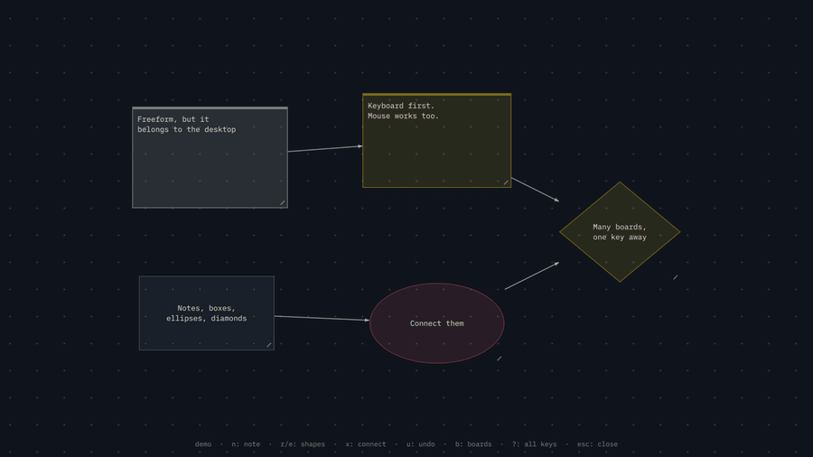

# Omarchyform

A local, keyboard-first board for arranging thoughts on Omarchy.

An infinite canvas. Notes, shapes and connectors on a board you can pan and
zoom, driven from the keyboard, stored as a plain JSON file on your own disk.

Capture a thought, arrange it spatially, get back to work. It follows your
Omarchy theme and keeps your boards on your own machine.



## What it is

A native Quickshell plugin. It runs inside the long-running `omarchy-shell`
process — no webview, no Electron, and no separate application service.
The controller stays loaded between opens; canvas surfaces exist only while
open, and pending saves can finish after closing.

It has two surfaces, and `w` switches between them:

- **Fullscreen** — a Hyprland layer-shell overlay above everything, with its
  own keyboard grab. Summon it, think, dismiss it.
- **Windowed** — an ordinary toplevel, so Hyprland tiles it beside your editor
  and browser like any other app.

The camera, the notes and the selection are shared, so toggling never loses
your place. The mode is remembered between sessions.

## Install

```bash
omarchy plugin add https://github.com/thepixelgardener-create/omarchyform.git --enable
```

Put it on the bar, which is the way to reach it without knowing a keybinding:

```bash
omarchy bar put thepixelgardener.omarchyform --section right
```

The sticky-note icon opens and closes the board, and carries the accent colour while it is
open. Its settings — autosave delay, keyboard step, dot grid, and whether the
board opens windowed — live on the bar entry and are handed to the board when
it opens, then remembered, so opening from the keyboard uses the same values.

For the keyboard route, bind a key in `~/.config/hypr/bindings.lua`:

```lua
o.bind("SUPER + SHIFT + I", "Omarchyform", "omarchy-shell shell toggle thepixelgardener.omarchyform")
```

Check the key is free first with `omarchy menu keybindings --print`, and
validate afterwards with `hyprctl reload && hyprctl configerrors`.

The plugin also ships `hypr/bindings.lua` with that same binding in it, for
people who would rather load plugin bindings than write their own. Omarchy
does not read those files on its own — `hyprland.lua` only loads your
`hypr/bindings.lua` — so add a loader to it once:

```lua
-- Load keybindings shipped by installed Omarchy plugins.
local plugins = os.getenv("HOME") .. "/.config/omarchy/plugins"
local found = io.popen("find " .. plugins .. " -maxdepth 3 -name bindings.lua 2>/dev/null")
if found then
  for file in found:lines() do dofile(file) end
  found:close()
end
```

Use the loader or your own `o.bind`, not both: the same key declared twice is
declared twice.

## Keys

Press `?` or `F1` on the board for this list.

| Key | Does |
|-----|------|
| `n` | New note beside the selected one, ready to type |
| `r` / `e` | New box / ellipse |
| `p` / `Shift+P` | Pin as background / select backgrounds to unpin |
| `s` | Cycle the shape: note, box, ellipse, diamond |
| `x` | Connect: press on one, then on another; again to turn it round |
| `X` | Remove every connector on this item |
| `u` / `ctrl+r` | Undo / redo |
| `enter` / `i` | Type in the selected note |
| `esc` | Stop typing, drop the marks, then close the board |
| `h` `j` `k` `l` | Move the selection to the nearest note that way |
| `H` `J` `K` `L` | Push the selected note around |
| `Ctrl+HJKL` | Resize selected items |
| `tab` | Cycle through every note |
| `space` | Mark this item as well, so the next command takes both |
| `a` | Mark everything |
| `d` / `del` | Delete what is marked, or the one under the cursor |
| `c` | Cycle its theme role: foreground, accent, urgent, muted |
| `b` | Boards: browse, open, create |
| `w` | Switch between fullscreen and windowed |
| `f` | Fit the whole board on screen |
| `0` | Reset the view |
| `+` / `-` | Zoom |
| `?` / `F1` | Keybinding list |

`space` marks the item under the cursor. Moving, resizing, recolouring,
changing shape and deleting then apply to everything marked, and the cursor
item decides what the rest become, so a mixed selection lands on one colour
rather than each cycling from its own. With nothing marked, every command
applies to the cursor alone, so the keys behave exactly as before until you
ask for more.

Mouse works too: Shift-click to mark items together, drag a marked item to move
the set, drag the canvas to pan, wheel to
zoom, double-click empty canvas for a new note, double-click a note to type in
it, drag the bottom-right corner to resize marked items, middle-click to delete
the clicked item.

## Backgrounds

Place and resize a shape, then press `p` to pin it. It stays behind notes and
connectors, moves with the canvas, and leaves your mouse free to pan or create
notes over it. Normal navigation, mark-all, editing and deletion skip pinned items.

Press `Shift+P` to select backgrounds with Tab, HJKL or the mouse, then `p` to
unpin the selected one. Escape leaves background selection. Pinning supports
undo/redo and is saved with the board. Notes can be pinned as labels too; items
inside a background remain independent.

## Boards

`b` opens the board browser: a shell-like walk through your boards directory.

| Key | Does |
|-----|------|
| `j` `k` | Move the cursor |
| `l` / `enter` | Enter a folder, or open a board |
| `h` / `backspace` | Go up a level |
| `/` | Search every board in the tree, not just this folder |
| `a` | New board here |
| `A` | New folder here |
| `r` | Rename |
| `x` twice | Delete (refuses the open board and folders containing it) |
| `g` / `G` | First / last |
| `esc` | Leave the search, then close the browser |

Search is a subsequence match over the whole path, so `wpa` finds
`work/project-a`. While you are searching, letters go into the query — press
Escape first if you want `a`, `r` or `x`.

The browser opens in the folder of the board you are on, and the board you are
on is marked `·open`.

Deleting a board or a folder moves it to `~/.local/share/omarchyform/trash/`
rather than destroying it, and records where it came from, so `t` and `enter`
put it back exactly where it was. An occupied destination is refused and the
item stays in the trash. Filesystem operations reject traversal and symlink
paths. If the trash index cannot be saved, the browser keeps its pending state
and shows `ctrl+s` to retry; keep the application running until that succeeds. Only `x` inside the trash actually destroys
something, and it asks twice.

## Saving

There is no save key, though `ctrl+s` works if you want one. Structural
changes — adding, deleting, moving, connecting — are written immediately.
Typing settles for 700ms first, so a sentence is one write rather than forty.
Switching boards or closing flushes whatever is pending. Board switching waits
for writes to finish. A failed backup or write leaves the board open in memory
and shows an error; use `ctrl+s` to retry. A slow save stays in progress until
the disk operation completes; retrying cannot replace its destination. Closing the surface keeps an in-flight
save running in the shell; it does not wait for disk completion.

Which board you had open is remembered in `state.json` and reopened next time.

## Where your board lives

```
~/.local/share/omarchyform/
├── boards/
│   ├── board.json
│   └── work/
│       └── project-a.json
├── trash/
│   ├── index.json
│   └── 20260924-133036-work__sprint.json
├── backups/
│   └── v2/
│       ├── board.json.bak
│       └── work/project-a.json.bak
└── state.json
```

Each board is plain JSON, written atomically. One generation back is kept in
`~/.local/share/omarchyform/backups/`, under `v2/`, mirroring the board directory tree — out of the boards tree, which is meant to be browsed, hand-edited
and committed without `.bak` files in the way. Older flattened backups are
left untouched; new saves use the mirrored paths to avoid naming collisions. The backup completes before replacement, and saves
with unchanged contents do not rotate it. Malformed or unsupported board files
open read-only; no edits or saves are allowed over them. Back it up, sync it,
edit it by hand, put it in git — it is your file. Older boards are migrated on load: v1 had no ids or
shapes, v2 stored fixed pastel hexes which are mapped onto theme roles. Version 4 adds
background pinning; older plugin versions open these files read-only instead
of silently losing that state.

```json
{
  "version": 4,
  "nextId": 3,
  "items": [
    { "id": 1, "kind": "note", "x": 0, "y": 0, "w": 180, "h": 140,
      "tint": "foreground", "text": "hello", "pinned": false },
    { "id": 2, "kind": "ellipse", "x": 300, "y": 0, "w": 160, "h": 110,
      "tint": "accent", "text": "there", "pinned": false }
  ],
  "links": [ { "from": 1, "to": 2 } ]
}
```

Connectors reference item ids rather than positions, so they survive
deletions, reordering and hand-editing. They are directed: `from` and `to`
decide which end carries the arrowhead, and only one runs between any pair.

## It looks like Omarchy, because it asks Omarchy

Nothing about the appearance is invented here. The board takes the theme's
font family and its size tokens, so it follows `omarchy display text size`
like the rest of the desktop. Corners come from `Style.cornerRadius` (square
by default) and borders from `Style.normalBorderWidth`.

Items carry a **theme role** — `foreground`, `accent`, `urgent` or `muted` —
rather than a fixed colour, drawn as a translucent wash plus a hairline of the
same role. Switch your theme and the board switches with it. `c` cycles the
role.

**Day and night** is not a setting here either. Omarchy themes declare
`mode = "light"` or `mode = "dark"` in their `colors.toml`; the board reads
that and adjusts the weight of its washes and its dot grid accordingly. A
third-party theme that omits `mode` falls back to the background's Rec. 709
luminance.

## Layout

| File | Holds |
|------|-------|
| `Omarchyform.qml` | Controller: editing, navigation, and the two surfaces |
| `Board.qml` | The canvas surface — grid, connectors, keys, cheat sheet |
| `Node.qml` | One item: note, box, ellipse or diamond |
| `Browser.qml` | The board browser |
| `BoardBar.qml` | The bar widget: the board's presence in the shell |
| `Help.qml` | Scrollable keyboard help |
| `BoardStore.js` | Pure logic: parsing, marshalling, geometry. No QML |
| `BoardSession.qml` | Loading, autosave state, and board-switch coordination |
| `BoardPersistence.qml` | Serialized backup and atomic write, with completion/failure signals |
| `BoardFiles.sh` | Confined filesystem operations and exact-path moves |

## Tests

The pure logic lives in plain JavaScript so it can be tested without Qt, and
the suite loads the very file the plugin loads — there is no copy to drift.

```bash
npm test        # pure logic and controller regression tests, no dependencies
npm run mutate  # mutation testing
npm run bench   # board marshalling cost at size
npm run test:qml # headless persistence tests; requires installed Quickshell
npm run test:ui  # Qt Quick pointer, theme, and layout tests
npm run test:omarchy -- --keep # live desktop smoke test, isolated board data
```

`npm run mutate` breaks `BoardStore.js` on purpose, one edit at a time, and
checks the suite notices. The command reports its current score and survivors;
it is a diagnostic, not a CI failure threshold.

Review survivors when changing the pure logic; a passing mutation command is
not a substitute for the runtime and filesystem regression tests.

A contract check reads the names the views and the session reach for on the
controller and fails if any of them is missing — including from the stub the
QML session test uses in the controller's place. QML resolves those names at
runtime, so a missing one is a TypeError in a suite CI cannot run, which is
how two of them reached `main` behind green checks.

Controller tests evaluate the actual QML JavaScript functions with delayed I/O
completion to cover damaged files, queued edits, board switching, and retry.
The separate `test:qml` suite runs the real persistence and session components
in isolated headless Quickshell instances with temporary files. It checks backup
contents, write ordering, failure handling, retry, queued edits, and switching
between fresh, saved, and damaged boards. It does not interact with the running
desktop shell. CI runs the Node and Qt Quick tests. Run `test:qml` and
`test:omarchy` on an Omarchy machine before release. The live test opens test
surfaces and targets keyboard events at its own process; it preserves your
installed plugin, boards, and theme.

See [the compatibility review](docs/omarchy-compatibility.md) for the tested
versions, first-party references, results, and remaining limits.

## Speed

`npm run bench` prints what a board costs to serialise and to load, at size.
Loading used to be superlinear — every connector scanned the whole item list to
resolve its two ends — so a 3000-item board took about 19ms to load and a
1000-item one about 3.6ms. Resolving the ends through a single index instead
makes it linear: roughly 6ms and 2ms.

Saving still forks `bash`, `cp` and `mv` to stage the backup before the board is
replaced, which costs about 9ms per save regardless of board size — far more
than serialising and writing one. Doing that copy in-process would remove it,
but the backup is what guarantees the previous version is safely on disk before
the board is overwritten, and the obvious rewrites broke that guarantee. It is
left alone deliberately, behind the autosave delay, rather than traded for
speed.

## Notes on the platform

Omarchy is pre-release and the shell's `qs.Commons` singletons are
internals, not a versioned API. Every read of them here goes through a guard
with a hardcoded fallback, so a rename upstream costs a wrong colour rather
than a board that will not open. An import disappearing entirely is still
fatal — QML has no optional imports.

The overlay is built through `Variants` so its surface is constructed with its
screen already set, and it opens on whichever output Hyprland has focused.
Assigning `screen` to a window that already exists leaves it unmapped.

## Dependencies

None beyond Omarchy itself. No network access, no external services, and no
elevated privileges. Saving uses short-lived local filesystem commands.

## Development

```bash
git clone https://github.com/thepixelgardener-create/omarchyform.git
cp -r omarchyform ~/.config/omarchy/plugins/thepixelgardener.omarchyform
omarchy-shell shell rescanPlugins
omarchy plugin enable thepixelgardener.omarchyform
```

Validate before publishing:

```bash
omarchy plugin validate .
qml_imports=$(mktemp -d)
ln -s "$OMARCHY_PATH/shell" "$qml_imports/qs"
/usr/lib/qt6/bin/qmllint -I "$qml_imports" Omarchyform.qml Board.qml Browser.qml Node.qml Help.qml BoardSession.qml BoardPersistence.qml
rm -rf "$qml_imports"
```

The temporary import tree resolves Omarchy's `qs.Commons` namespace. The
installed QML metadata still produces warnings about `PanelWindow`,
`QProcess::ExitStatus`, and the dynamic Style font object. The live test checks
that those types and properties work in the actual runtime.

`keepLoaded: true` keeps this overlay mounted between summons. On the tested
Omarchy version, `omarchy-shell shell rescanPlugins` unloads and recreates
panels and overlays, including kept overlays. The special reload retention for
kept services does not apply here. Save with `ctrl+s` and wait for the saving
indicator to clear before rescan or shell restart; forced unload can interrupt
an asynchronous save.

## Not there yet

Freehand drawing and images are outside the current scope.

## License

MIT
