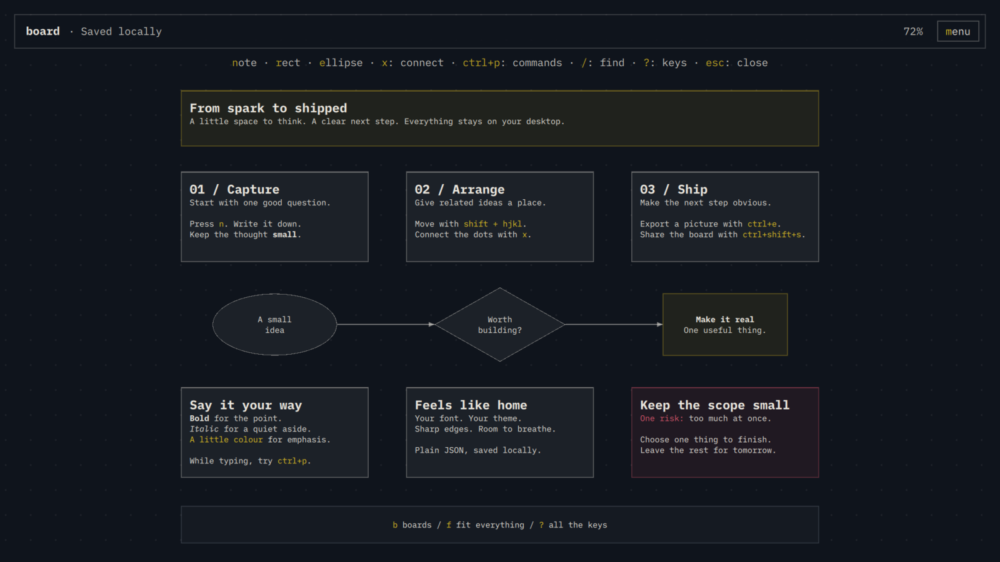
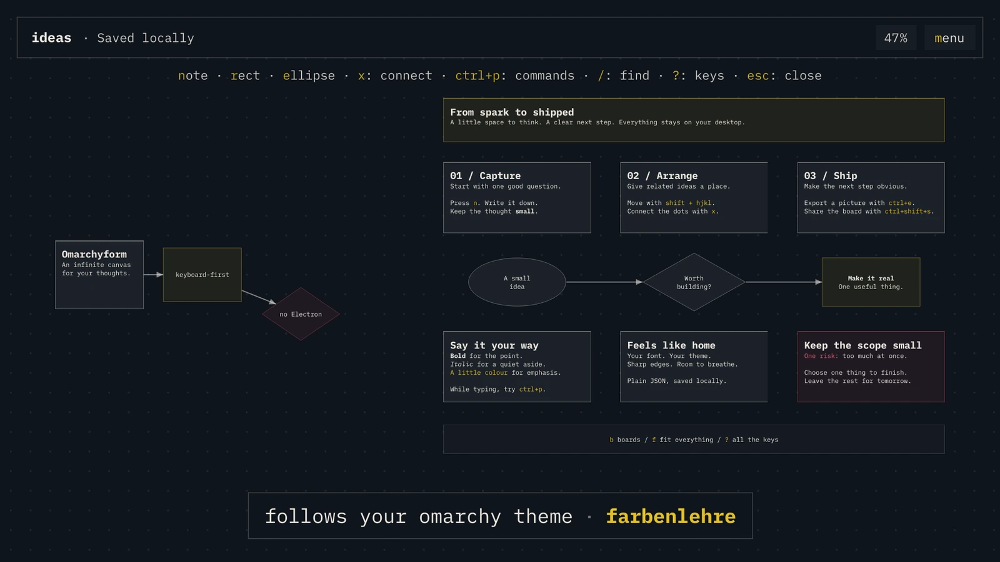

# Omarchyform

A local whiteboard for brainstorming, mind maps and diagrams on Omarchy.

Sticky notes, pictures, shapes and connectors on an infinite canvas, driven
from the keyboard and drawn in your Omarchy theme. Each board is a plain JSON
file on your own disk: no account, no network, no service running beside it.



## Install

```bash
omarchy plugin add https://github.com/thepixelgardener-create/omarchyform.git --enable
```

Answer the question about where the bar icon goes: the sticky-note icon opens
and closes the board. To open it from the keyboard as well, add a binding to
`~/.config/hypr/bindings.lua`:

```lua
o.bind("SUPER + SHIFT + I", "Omarchyform", "omarchy-shell shell toggle thepixelgardener.omarchyform")
```

It is also in the [Omarchy plugin directory](https://plugins.omarchy.org/?text=omarchyform).
Updating, removing and the optional desktop entry are in the
[install guide](docs/install.md).

## The first minute

| Key | Does |
|-----|------|
| `n` | New note, ready to type |
| `esc` | Stop typing; press again to close the board |
| `h` `j` `k` `l` | Move to the nearest note that way |
| `x`, move, `x` | Connect two items |
| `u` | Undo |
| `:` | Run any command by name, with its key shown beside it |
| `?` | Every key |

You do not have to learn the keys first: `:` lists every command, and `.` or a
right-click lists what can be done with the selection. The mouse works too.

## What it does

- Notes, boxes, ellipses, diamonds and pictures, pasted or dropped, joined by connectors
- Headings, bold, italic, key labels and theme colours inside a note
- A fullscreen overlay or an ordinary tiled window; `w` switches between them
- Split view, `v` or `V`: two boards side by side, or two views of one
- A timeline, `t`, that plays back how a board was built
- Boards in folders, with search and a trash, on `b`
- PNG export in your theme, on white for documents, or in black and white for print
- A board shared as one file with its pictures inside it
- A [command line](docs/files.md#from-the-command-line) for scripts and coding agents



## Feedback

Omarchyform is young and made by one person, so every report shapes what comes
next. I want to hear what you used it for, what got in your way, and what you
expected to find and did not.

- **[Share feedback or an idea](https://github.com/thepixelgardener-create/omarchyform/issues/new?template=feedback.yml)**: a few short questions
- **[Report a bug](https://github.com/thepixelgardener-create/omarchyform/issues/new?template=bug.yml)**
- Security problems go through the private route in [SECURITY.md](SECURITY.md)

If it is useful to you, a star here or a heart in the plugin directory helps
other people find it.

## Documentation

- [Install, update and remove](docs/install.md): the key binding, the desktop entry, dependencies, tested versions
- [Using the board](docs/guide.md): every key, note formatting, connectors, split view, history, export and saving
- [Boards on disk and the command line](docs/files.md): where boards live, the file format and `bin/omarchyform`
- [Development](docs/development.md): running from a clone, the source layout, tests and benchmarks
- [Changelog](CHANGELOG.md), [roadmap](docs/roadmap.md) and the [documentation guide](docs/README.md)

## License

MIT. Clipboard support invokes `wl-clipboard` (GPL-2.0-or-later) as a separate
process; it is not redistributed here.
